<a href="https://xivlabs.tech">
  <picture>
    <source media="(prefers-color-scheme: dark)" srcset="assets/banner-dark.svg">
    
  </picture>
</a>

  
  
  

Live from <a href="https://github.com/itsF4LCON/hive">hive</a>, my honeypot. Every number above is someone trying to break in.

### Projects

<table>
  <tr>
    <td width="33%" valign="top">
      <b><a href="https://github.com/itsF4LCON/aps">aps</a></b> Rust 
      Edge anti-phishing scanner that judges a link in under 15ms. 
      <a href="https://xivlabs.tech/#aps-demo">Try it</a>
    </td>
    <td width="33%" valign="top">
      <b><a href="https://github.com/itsF4LCON/hive">hive</a></b> Rust 
      SSH/HTTP honeypot that lets no one in and maps every attempt. 
      <a href="https://xivlabs.tech/#attacks">Attack map</a> · <a href="https://xivlabs.tech/reports">Reports</a>
    </td>
    <td width="33%" valign="top">
      <b><a href="https://github.com/itsF4LCON/hive-blocklist">hive-blocklist</a></b> Python 
      Self-updating blocklist of the IPs attacking hive, rebuilt weekly. 
      <a href="https://github.com/itsF4LCON/hive-blocklist/tree/main/lists">Get the list</a>
    </td>
  </tr>
  <tr>
    <td width="33%" valign="top">
      <b><a href="https://github.com/itsF4LCON/postburn">postburn</a></b> Rust 
      One-time secret links. The server never sees the key. 
      <a href="https://burn.xivlabs.tech">Send a secret</a>
    </td>
    <td width="33%" valign="top">
      <b><a href="https://github.com/itsF4LCON/desk">desk</a></b> Rust 
      Your Linux desktop in any browser, 1080p60 over WebRTC. 
      Self-hosted
    </td>
    <td width="33%" valign="top">
      <b><a href="https://github.com/itsF4LCON/dealbreaker">dealbreaker</a></b> Rust 
      Card game for 2-8 friends where special cards start mini-games. 
      <a href="https://dealbreaker.xivlabs.tech">Play now</a>
    </td>
  </tr>
</table>

### Stack

Cloudflare Workers · Durable Objects · D1 · KV · Tunnel · Access
