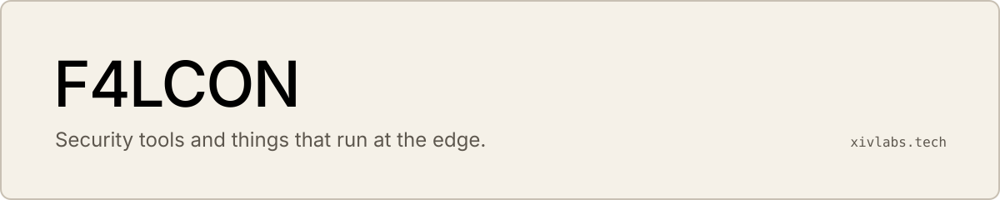
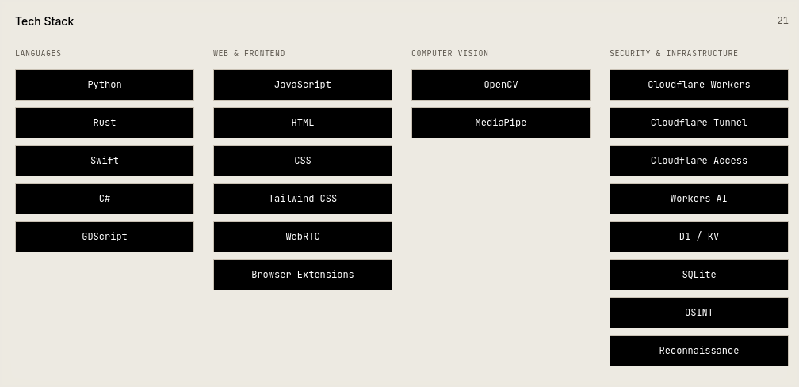

  
  
  

Live from <a href="https://github.com/itsF4LCON/hive">hive</a>, my honeypot. Every number above is someone trying to break in.

### About

Self-taught Cybersecurity Developer from Belgium, coding since I was 12.

### Stack

  

